  

# Good morning, Night City

I'm Kamil, a full-stack developer based in  Poland. I focus on building fast, stable, and modern web applications. Lately, I've been dropping Node.js to build high-performance backends with  Bun and  ElysiaJS. I also dive into the  Minecraft ecosystem, developing custom plugins and forks using  Kotlin &  Java.

> [!NOTE]
> My portfolio is currently a work in progress, but the core content is already up and running.

🔗 **Portfolio:** [kznlabs.com](https://kznlabs.com)

### Current Focus

- **Status:** Open to new projects, collaborations, and full-stack opportunities.
- **Stack:** TypeScript, Bun, ElysiaJS, React, Next.js, Kotlin
- **Previous Experience:** PHP, Python

---

### Tech Stack

<strong>Languages & Core</strong>

  

<strong>Frameworks & Backend (Web & Gaming)</strong>

  

<strong>DevOps, Tools & Cloud</strong>

  

<strong>OS, Apps & Design</strong>

  

<strong>Familiar With / Legacy Stack</strong>

  

  
<b>👀 Click here for text version</b>

   
  <ul>
    <li><b>Languages & Core:</b> TypeScript, JavaScript, Java, Kotlin, HTML, CSS, Sass</li>
    <li><b>Frameworks & Backend:</b> Bun, Node.js, ElysiaJS, Express, React, Next.js, Tailwind CSS, Tailwind Merge, Styled Components, WXT, Discord.js, PaperMC, MySQL</li>
    <li><b>DevOps, Tools & Cloud:</b> Git, GitHub, Docker, npm, pnpm, Gradle, Prettier, DBeaver, Vercel, Cloudflare</li>
    <li><b>OS, Apps & Design:</b> Ubuntu, Windows, Google Chrome, VS Code, IntelliJ IDEA, Figma, Adobe Photoshop, Affinity</li>
    <li><b>Familiar With / Legacy:</b> PHP, PhpStorm, WebStorm, PyCharm</li>
  </ul>

---

### Stats & Activity

  
    
  

---

### Featured Projects

---

### Let's Connect

> [!IMPORTANT]
> My portfolio contact page is currently under construction. Please use direct email to reach out: **contact@kznlabs.com**

Hit me up to talk about tech, web apps, Minecraft plugins, or just to say hi!

